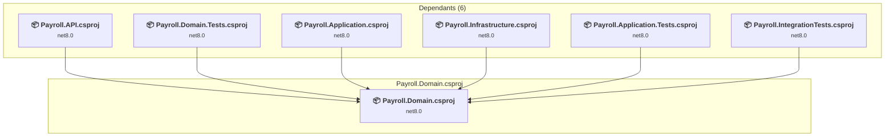

# Payroll.Domain\Payroll.Domain.csproj

[← Back to the assessment index](../../assessment.md)

## Project Info

- **Current Target Framework:** net8.0
- **Proposed Target Framework:** net10.0
- **SDK-style**: True
- **Project Kind:** ClassLibrary
- **Dependencies**: 0
- **Dependants**: 6
- **Number of Files**: 11
- **Number of Files with Incidents**: 1
- **Lines of Code**: 353
- **Estimated LOC to modify**: 0+ (at least 0.0% of the project)

## Related Projects

**Depended on by (6)** — projects that reference this one:

- [c:\Users\chunl\Documents\Personal\PayrollAnomalyDashboard\Payroll.API\Payroll.API.csproj](../projects/Payroll.API.md)
- [c:\Users\chunl\Documents\Personal\PayrollAnomalyDashboard\Payroll.Application.Tests\Payroll.Application.Tests.csproj](../projects/Payroll.Application.Tests.md)
- [c:\Users\chunl\Documents\Personal\PayrollAnomalyDashboard\Payroll.Application\Payroll.Application.csproj](../projects/Payroll.Application.md)
- [c:\Users\chunl\Documents\Personal\PayrollAnomalyDashboard\Payroll.Domain.Tests\Payroll.Domain.Tests.csproj](../projects/Payroll.Domain.Tests.md)
- [c:\Users\chunl\Documents\Personal\PayrollAnomalyDashboard\Payroll.Infrastructure\Payroll.Infrastructure.csproj](../projects/Payroll.Infrastructure.md)
- [c:\Users\chunl\Documents\Personal\PayrollAnomalyDashboard\Payroll.IntegrationTests\Payroll.IntegrationTests.csproj](../projects/Payroll.IntegrationTests.md)

## Dependency Graph

Legend:
📦 SDK-style project
⚙️ Classic project

## API Compatibility

| Category | Count | Impact |
| :--- | :---: | :--- |
| 🔴 Binary Incompatible | 0 | High - Require code changes |
| 🟡 Source Incompatible | 0 | Medium - Needs re-compilation and potential conflicting API error fixing |
| 🔵 Behavioral change | 0 | Low - Behavioral changes that may require testing at runtime |
| ✅ Compatible | 358 |  |
| ***Total APIs Analyzed*** | ***358*** |  |

