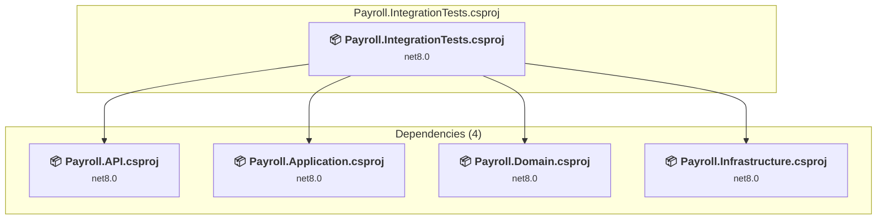

# Payroll.IntegrationTests\Payroll.IntegrationTests.csproj

[← Back to the assessment index](../../assessment.md)

## Project Info

- **Current Target Framework:** net8.0
- **Proposed Target Framework:** net10.0
- **SDK-style**: True
- **Project Kind:** DotNetCoreApp
- **Dependencies**: 4
- **Dependants**: 0
- **Number of Files**: 6
- **Number of Files with Incidents**: 4
- **Lines of Code**: 245
- **Estimated LOC to modify**: 6+ (at least 2.4% of the project)

## Related Projects

**Depends on (4)** — projects this one references:

- [c:\Users\chunl\Documents\Personal\PayrollAnomalyDashboard\Payroll.API\Payroll.API.csproj](../projects/Payroll.API.md)
- [c:\Users\chunl\Documents\Personal\PayrollAnomalyDashboard\Payroll.Application\Payroll.Application.csproj](../projects/Payroll.Application.md)
- [c:\Users\chunl\Documents\Personal\PayrollAnomalyDashboard\Payroll.Domain\Payroll.Domain.csproj](../projects/Payroll.Domain.md)
- [c:\Users\chunl\Documents\Personal\PayrollAnomalyDashboard\Payroll.Infrastructure\Payroll.Infrastructure.csproj](../projects/Payroll.Infrastructure.md)

## Dependency Graph

Legend:
📦 SDK-style project
⚙️ Classic project

## API Compatibility

| Category | Count | Impact |
| :--- | :---: | :--- |
| 🔴 Binary Incompatible | 0 | High - Require code changes |
| 🟡 Source Incompatible | 0 | Medium - Needs re-compilation and potential conflicting API error fixing |
| 🔵 Behavioral change | 6 | Low - Behavioral changes that may require testing at runtime |
| ✅ Compatible | 258 |  |
| ***Total APIs Analyzed*** | ***264*** |  |

## NuGet Package Issues

| Package | Current Version | Suggested Version | Severity | Issue |
| :--- | :---: | :---: | :---: | :--- |
| Microsoft.AspNetCore.Mvc.Testing | 8.0.10 | 10.0.12 | 🟡 Potential | NuGet package upgrade is recommended |
| xunit | 2.5.3 | — | 🔵 Optional | NuGet package is deprecated |

Every project affected by these packages, and the versions the repository settles on: [aggregate NuGet packages](../nuget/aggregate-packages.md).

